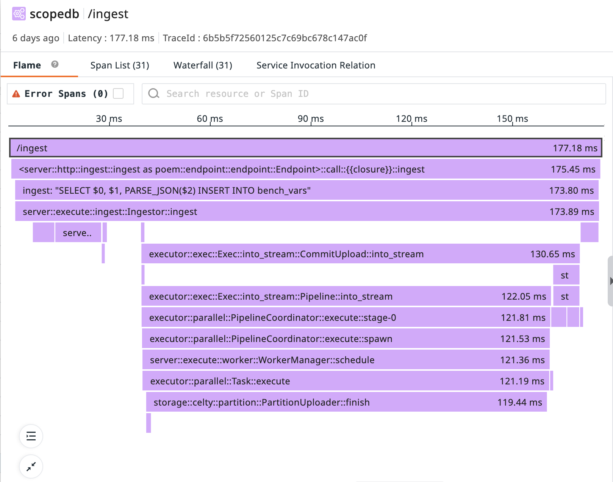
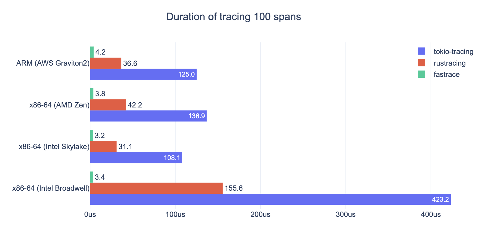

## TL;DR

Distributed tracing is critical for understanding modern microservice architectures. While `tokio-rs/tracing` is widely used in Rust, it comes with significant challenges: ecosystem fragmentation, complex configuration, and high overhead. 

[Fastrace](https://github.com/fast/fastrace) provides a production-ready solution with seamless ecosystem integration, out-of-box OpenTelemetry support, and a more straightforward API that works naturally with the existing logging infrastructure.

The following example demonstrates how to trace functions with `fastrace`:

```rust
#[fastrace::trace]
pub fn send_request(req: HttpRequest) -> Result<(), Error> {
    // ...
}
```

It's being used in production by products like [ScopeDB](https://www.scopedb.io/blog/manage-observability-data-in-petabytes), where it helps trace and debug petabyte-scale observability data workloads.



## Why Distributed Tracing Matters

Understanding what is happening inside your applications has never been more challenging in today's microservices and distributed systems. A user request might touch dozens of services before completion, and traditional logging approaches quickly fall short.

Consider a typical request flow:

```
User → API Gateway → Auth Service → User Service → Database
```

When an exception is thrown, or the app performs poorly, where exactly is the root cause? Individual service logs only show fragments of the whole trace, lacking the crucial context of how the request flows through your entire system.

This is where distributed tracing becomes essential. Tracing creates a connected view of your request's flow across service boundaries, making it possible to:

- Identify performance bottlenecks across services
- Debug complex interactions between components
- Understand dependencies and service relationships
- Analyze latency distributions and outliers
- Correlate logs and metrics with request context

## A Famous Approach: `tokio-rs/tracing`

For some Rust developers, `tokio-rs/tracing` is the go-to solution for application instrumentation. Let's look at how a typical implementation works:

```rust
fn main() {
    // Initialize the tracing subscriber
    // Complex configuration code omitted...
    
    // Create a span and record some data
    let span = tracing::info_span!("processing_request", 
        user_id = 42, 
        request_id = "abcd1234"
    );
    
    // Enter the span (activates it for the current execution context)
    let _guard = span.enter();
    
    // Log within the span context
    tracing::info!("Starting request processing");
    
    process_data();
    
    tracing::info!("Finished processing request");
}
```

For instrumenting functions, `tokio-rs/tracing` provides attribute macros:

```rust
#[tracing::instrument(skip(password), fields(user_id = user.id))]
async fn authenticate(user: &User, password: &str) -> Result<AuthToken, AuthError> {
    tracing::info!("Authenticating user {}", user.id);
    // ...more code...
}
```

## The Challenges with `tokio-rs/tracing`

According to our previous user experience, `tokio-rs/tracing` comes with several significant challenges:

### 1. Ecosystem Fragmentation

By introducing its own logging macros, `tokio-rs/tracing` creates a division with code using the standard `log` crate:

```rust
// Using log crate
log::info!("Starting operation");

// Using tracing crate (different syntax)
tracing::info!("Starting operation");
```

This fragmentation is particularly problematic for library authors. When creating a library, authors face a difficult choice:

1. Use the `log` crate for compatibility with the broader ecosystem
2. Use `tokio-rs/tracing` for better observability features

Many libraries choose the first option for simplicity, but miss out on the benefits of tracing.

While `tokio-rs/tracing` does provide a feature flag 'log' that allows emitting log records to the `log` crate when using `tokio-rs/tracing`'s macros, library authors must manually enable this feature flag to ensure all users properly receive log records regardless of which logging framework they use. This creates additional configuration complexity for library maintainers.

Furthermore, applications using `tokio-rs/tracing` must additionally install and configure the `tracing-log` bridge to properly receive log records from libraries that use the `log` crate. This creates a bidirectional compatibility problem requiring explicit configuration:

```toml
# Library's Cargo.toml
[dependencies]
tracing = { version = "0.1", features = ["log"] }  # Emit log records for log compatibility

# Application's Cargo.toml
[dependencies]
tracing = "0.1"
tracing-log = "0.2"  # Listen to log records for log compatibility
```

### 2. Performance Impact for Libraries

Library authors are particularly sensitive to performance overhead, as their code may be called in tight loops or performance-critical paths. `tokio-rs/tracing`'s overhead can be substantial when instrumented, which creates a dilemma:

1. Always instrument tracing (and impose overhead on all users)
2. Don't instrument at all (and lose observability)
3. Create an additional feature flag system (increasing maintenance burden)

    Here is a common pattern in libraries using `tokio-rs/tracing`:

    ```rust
    #[cfg_attr(feature = "tracing", tracing::instrument(skip(password), fields(user_id = user.id)))]
    async fn authenticate(user: &User, password: &str) -> Result<AuthToken, AuthError> {
        // ...more code...
    }
    ```

    Different libraries may define feature flags with subtly different names, making it hard for the final application to configure all of them.

With `tokio-rs/tracing`, there's no clean way to have tracing zero-cost disabled. This makes library authors reluctant to add instrumentation to performance-sensitive code paths.

### 3. No Context Propagation

Distributed tracing requires propagating context across service boundaries, but `tokio-rs/tracing` leaves this largely as an exercise for the developer. For example, this is [tonic's official example](https://github.com/hyperium/tonic/blob/master/examples/src/tracing/server.rs) demonstrating how to trace a gRPC service:

```rust
Server::builder()
    .trace_fn(|_| tracing::info_span!("grpc_server"))
    .add_service(MyServiceServer::new(MyService::default()))
    .serve(addr)
    .await?;
```

The above example only creates a basic span but doesn't extract tracing context from the incoming request.

The consequences of missing context propagation are severe in distributed systems. When a trace disconnects due to missing context:

- Instead of seeing a complete flow of a request like:
  ```
  Trace #1: Frontend → API Gateway → User Service → Database → Response
  ```

- You'll see disconnected fragments from a request:
  ```
  Trace #1: Frontend → API Gateway
  Trace #2: User Service → Database
  Trace #3: API Gateway → Response
  ```

- Even worse, when multiple requests are interleaved, the traces become a chaotic mess:
  ```
  Trace #1: Frontend → API Gateway
  Trace #2: Frontend → API Gateway
  Trace #3: Frontend → API Gateway
  Trace #4: User Service → Database
  Trace #6: API Gateway → Response
  Trace #5: User Service → Database
  ```

This fragmentation makes it extremely difficult to follow request flows, isolate performance issues, or understand causal relationships between services.

## Introducing `fastrace`: A Fast and Complete Solution

### 1. Zero-cost Abstraction

`fastrace` is designed with real zero-cost abstraction. When disabled, instrumentations are completely omitted from compilation, resulting in no runtime overhead. This makes it ideal for libraries concerned about performance.

### 2. Ecosystem Compatibility

`fastrace` focuses exclusively on distributed tracing. Through its composable design, it integrates seamlessly with the existing Rust ecosystem, including compatibility with the standard `log` crate. This architectural approach allows libraries to implement comprehensive tracing while preserving their users' freedom to use their preferred logging setup.

### 3. Simplicity First

The API is designed to be intuitive and require minimal boilerplate, focusing on the most common use cases while still providing extensibility when needed.

### 4. Insanely Fast



`fastrace` is designed for high-performance applications. It can handle massive amounts of spans with minimal impact on CPU and memory usage.

### 5. Ergonomic for both Applications and Libraries

Libraries can use `fastrace` without imposing performance penalties when not needed:

```rust
#[fastrace::trace]  // Zero-cost when the application doesn't enable the 'enable' feature
pub fn process_data(data: &[u8]) -> Result<Vec<u8>, Error> {
    // Library uses standard log crate
    log::debug!("Processing {} bytes of data", data.len());
    
    // ...more code...
}
```

The key point here is that libraries should include `fastrace` without enabling any features:

```toml
[dependencies]
fastrace = "0.7"  # No 'enable' feature
```

When an application uses this library and doesn't enable the 'enable' feature of `fastrace`:
- All tracing code is completely optimized away at compile time
- Zero runtime overhead is added to the library
- No impact on performance-critical code paths

When the application does enable tracing via the 'enable' feature:
- Instrumentation in the dedicated library becomes active
- Spans are collected and reported
- The application gets full visibility into library behavior

This is a significant advantage over other tracing solutions that either always impose overhead or require libraries to implement complex feature-flag systems.

### 6. Seamless Context Propagation

`fastrace` provides companion crates for popular frameworks that handle context propagation automatically:

```rust
// For HTTP clients with reqwest
let response = client.get(&format!("https://user-service/users/{}", user_id))
    .headers(fastrace_reqwest::traceparent_headers())  // Automatically inject trace context
    .send()
    .await?;

// For gRPC servers with tonic
Server::builder()
    .layer(fastrace_tonic::FastraceServerLayer)  // Automatically extracts context from incoming requests
    .add_service(MyServiceServer::new(MyService::default()))
    .serve(addr);

// For gRPC clients
let channel = ServiceBuilder::new()
    .layer(fastrace_tonic::FastraceClientLayer)  // Automatically injects context into outgoing requests
    .service(channel);

// For data access with Apache OpenDAL
let op = Operator::new(services::Memory::default())?
    .layer(opendal::layers::FastraceLayer)  // Automatically traces all data operations
    .finish();
op.write("test", "0".repeat(16 * 1024 * 1024).into_bytes())
    .await?;
```

This provides out-of-box distributed tracing without manual context handling.

## The Complete Solution: `fastrace` + `log` + `logforth`

`fastrace` deliberately focuses on doing one thing well: tracing. Through its composable design and the Rust's great ecosystem, a powerful combination emerges:

- **log**: The standard Rust logging facade
- **logforth**: A flexible logging implementation with industrial-ready features
- **fastrace**: High-performance tracing with distributed context propagation

This integration allows automatically associating your logs with trace spans, providing correlation without requiring using different logging macros:

```rust
log::info!("Processing started");

// Later, in your logging infrastructure, you can see which trace and span
// each log entry belongs to.
```

To illustrate the simplicity of this approach, here's a streamlined example of building a microservice with complete observability:

```rust
#[poem::handler]
#[fastrace::trace]  // Automatically creates and manages spans
async fn get_user(Path(user_id): Path<String>) -> Json<User> {
    // Standard log calls are automatically associated with the current span
    log::info!("Fetching user {}", user_id);
    
    let user_details = fetch_user_details(&user_id).await;
    
    Json(User {
        id: user_id,
        name: user_details.name,
        email: user_details.email,
    })
}

#[fastrace::trace]
async fn fetch_user_details(user_id: &str) -> UserDetails {
    let client = reqwest::Client::new();
    
    let response = client.get(&format!("https://user-details-service/users/{}", user_id))
        .headers(fastrace_reqwest::traceparent_headers())  // Automatic trace context propagation
        .send()
        .await
        .expect("Request failed");
        
    response.json::<UserDetails>().await.expect("Failed to parse JSON")
}

#[tokio::main]
async fn main() {
    // Configure logging and tracing
    setup_observability("user-service");
    
    let app = poem::Route::new()
        .at("/users/:id", poem::get(get_user))
        .with(fastrace_poem::FastraceMiddleware); // Automatic trace context extraction
        
    poem::Server::new(poem::listener::TcpListener::bind("0.0.0.0:3000"))
        .run(app)
        .await
        .unwrap();
        
    fastrace::flush();
}

fn setup_observability(service_name: &str) {
    // Setup logging with logforth
    logforth::stderr()
        .dispatch(|d| {
            d.filter(log::LevelFilter::Info)
                // Attaches trace id to logs
                .diagnostic(logforth::diagnostic::FastraceDiagnostic::default())
                // Attaches logs to spans
                .append(logforth::append::FastraceEvent::default())
        })
        .apply();

    // Setup tracing with fastrace
    fastrace::set_reporter(
        fastrace_jaeger::JaegerReporter::new("127.0.0.1:6831".parse().unwrap(), service_name).unwrap(),
        fastrace::collector::Config::default()
    );
}
```

## Conclusion

`fastrace` represents a modern approach to distributed tracing in Rust. The most significant advantages of `fastrace` are:

1. **Zero Runtime Overhead When Disabled**: Libraries can add rich instrumentation without worrying about performance impact when tracing is not enabled by the application.

2. **No Ecosystem Lock-In**: Libraries can use `fastrace` without forcing their users into a specific logging ecosystem.

3. **Simple API Surface**: The minimal API surface makes it easy to add comprehensive tracing with little code.

4. **Predictable Performance**: `fastrace`'s performance characteristics are consistent and predictable, even under high load.

An ecosystem where libraries are comprehensively instrumented with `fastrace` would enable unprecedented visibility into applications, without the performance or compatibility concerns that have historically prevented such instrumentation.

## Resources

- [fastrace](https://github.com/fast/fastrace)
- [fastrace-jaeger](https://crates.io/crates/fastrace-jaeger)
- [fastrace-opentelemetry](https://crates.io/crates/fastrace-opentelemetry)
- [fastrace-reqwest](https://crates.io/crates/fastrace-reqwest)
- [fastrace-poem](https://crates.io/crates/fastrace-poem)
- [fastrace-tonic](https://crates.io/crates/fastrace-tonic)
- [logforth](https://crates.io/crates/logforth)
